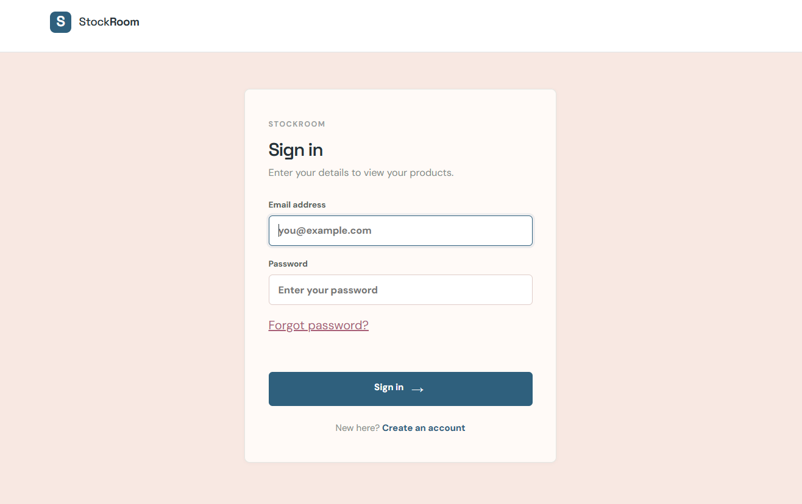
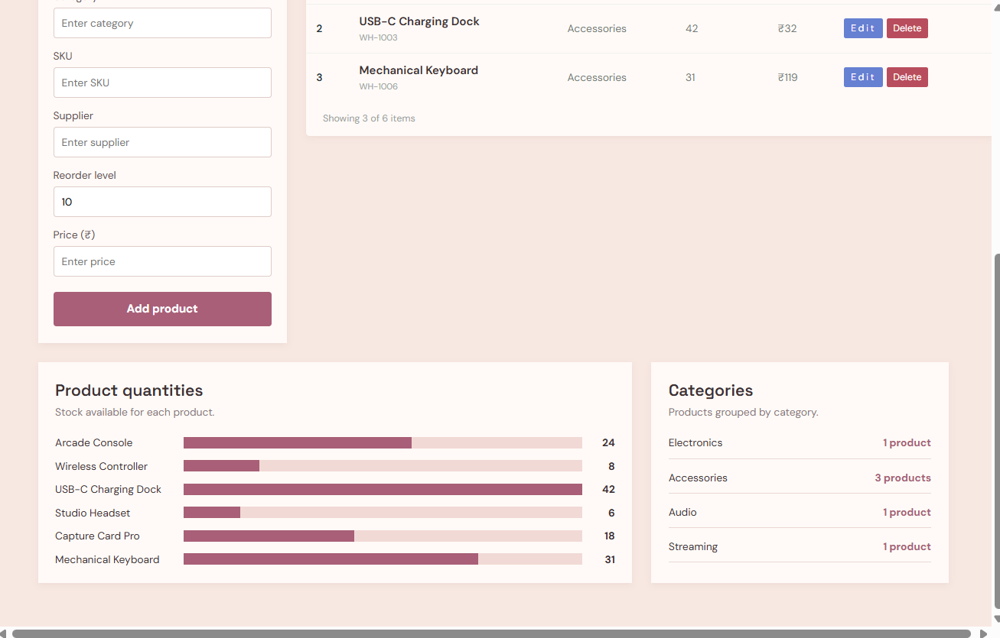
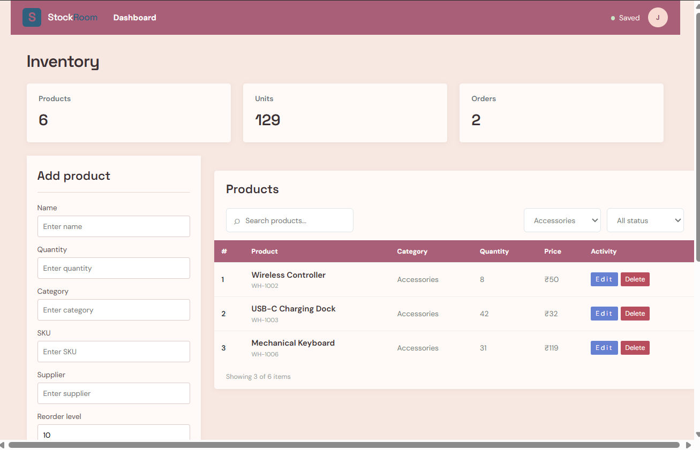

# StockRoom

StockRoom is a simple inventory management web application built with Java, Spring Boot and SQL. It lets users manage products, track stock levels and view inventory statistics, with prices shown in Indian rupees (INR).

## Features

- User registration and login (passwords stored as BCrypt hashes)
- Password reset page (demo version, see Known Limitations)
- Add products with name, SKU, category, supplier, quantity, reorder level and price
- Search products by name or SKU
- Increase or decrease stock quantities
- Delete products
- Inventory statistics: total items, units on hand, low-stock count and inventory value
- INR currency display
- H2 SQL database with separate `schema.sql` and `data.sql` files

## Technology

- Java 17
- Spring Boot 3.4
- Spring MVC and Thymeleaf
- Spring Data JPA
- H2 database (file-based)
- HTML, CSS and JavaScript
- Maven

## Run Locally

Requirements: Java 17 or later and Maven.

```
mvn spring-boot:run
```

Or build and run the jar:

```
mvn package
java -jar target/stockroom-inventory-1.0-SNAPSHOT.jar
```

Open http://localhost:8080 and register a new account to get started.

## Database

The application uses a file-based H2 database stored at `data/inventory-db`.

- `src/main/resources/schema.sql` creates the tables
- `src/main/resources/data.sql` adds sample inventory records
- `src/main/resources/application.properties` holds the configuration

## Screenshots

### Login


### Dashboard


### Products and statistics


## API Endpoints

| Method | Route | Purpose |
| ------ | ----- | ------- |
| POST | `/api/auth/register` | Create an account |
| POST | `/api/auth/login` | Sign in |
| POST | `/api/auth/logout` | Sign out |
| POST | `/api/auth/forgot-password` | Reset a password |
| GET | `/api/auth/me` | Get the signed-in user |
| GET | `/api/inventory` | List products (optional `?search=`) |
| GET | `/api/inventory/summary` | Inventory statistics |
| POST | `/api/inventory` | Add a product |
| PATCH | `/api/inventory/{id}/adjust` | Change stock quantity |
| DELETE | `/api/inventory/{id}` | Delete a product |

Web pages: `/login`, `/register`, `/forgot-password`, `/inventory`.

## Project Structure

```
src/main/java/        Controllers, entities and repositories
src/main/resources/   SQL scripts, Thymeleaf templates, CSS and JavaScript
data/                 Local database files created at runtime
```

The `data/` and `target/` folders are excluded from Git using `.gitignore`.

## Known Limitations

This is a learning project. Possible improvements:

- Add a service layer and input validation
- Protect the inventory API with authentication checks
- Replace the password reset with an email-based reset link
- Use `BigDecimal` for prices
- Switch from H2 to MySQL or PostgreSQL
- Add unit tests
